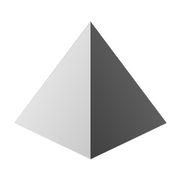

<p align="center">
  
</p>

<h3 align="center">
Scaling agents for everyone
</h3>

<p align="center">
| <a href="https://tetral.ai"><b>Website</b></a> | <a href="https://github.com/tetral-ai/tetral-sdk-typescript"><b>TypeScript SDK</b></a> | <a href="#getting-started"><b>Getting Started</b></a> | <a href="AGENTS.md"><b>Contributing</b></a> | <a href="LICENSE"><b>License</b></a> |
</p>

---

## About

Tetral is an open-source platform for scaling AI agents. The agent loop runs
as a first-class cloud runtime on your own Kubernetes — sessions are durable
resources that sleep when idle, wake on input, and keep going through sandbox
and pod restarts — behind an Anthropic-compatible API. Cost follows active
compute.

Tetral scales agents with:

- **A cloud-native runtime**: the agent loop is scheduled by Kubernetes;
  sessions sleep and wake; settlement is durable and replay-safe; sandbox
  loss and runtime-pod loss are recovered conditions, handled by design.
- **Disposable sandboxes**: every session gets its own sandbox as an
  execution surface — created on demand, stopped when idle, archived and
  cleaned up on schedule.
- **One database**: sessions, full event history, queues, memory,
  credentials — everything durable lives in PostgreSQL. One system to
  operate and back up, and the complete audit trail is a SQL query.
- **Single-version releases**: one git tag, four images, and one Helm chart
  carry the same platform version.

Tetral is compatible and complete:

- **Anthropic-compatible API**: sessions, files, skills, memory stores, and
  models served under `/v1` in the upstream shape; the
  [TypeScript SDK](https://github.com/tetral-ai/tetral-sdk-typescript) is a
  maintained fork of the official Anthropic SDK, and every deviation is a
  registered compatibility case with a test.
- **Bring your own model**: request lowering, stream raising, and the model
  catalog live in one gateway package — adding a model or provider is a
  catalog-and-lowering change.
- **A full agent toolbelt**: per-session sandboxes, file resources, skills,
  memory, MCP connectors, web search and fetch, and credential-injecting
  Git — sandboxes never hold repository credentials.
- **Storage you choose**: one S3-compatible configuration surface across
  Cloudflare R2, AWS S3, MinIO, and B2.
- **Sandboxes you choose**: sandbox providers sit behind a narrow driver
  seam (Daytona today).

## Getting Started

Tetral is self-hosted infrastructure for teams that operate their own
Kubernetes. It deploys on any conformant cluster — from a single-node K3s
machine to a full multi-node cluster, the same manifests and the same
version. Prerequisites: a Kubernetes cluster, PostgreSQL 18, an
S3-compatible bucket, and a sandbox provider credential.

Two install paths, one platform version:

- **Helm** — reproducible, versioned installs: one `values.yaml` carries the
  whole configuration contract; use plain `helm upgrade`, and roll back only
  between releases with no schema migration.
- **kubectl** — the raw manifests in
  [`deploy/kubernetes/`](deploy/kubernetes/), for operators who want every
  object auditable and editable.

The first tagged release (`0.1.0-alpha`) publishes the images and the chart.
Until then, build from source:

```bash
make build && make test          # Go services
bun install && bun run build     # services/agent-runtime, services/gateway
```

Each service's contract — responsibilities, lifecycle, seams, testing —
lives in `services/<name>/README.md`.

## Contributing

Contributions are welcome from any authorship — human, AI, or both — as
long as you can explain them. Start with [AGENTS.md](AGENTS.md) for the
repository map and build commands, then [CONTRIBUTING.md](CONTRIBUTING.md)
for the pre-PR self-check every contribution runs.

## Contact

Questions, bug reports, and proposals go to
[GitHub Issues](https://github.com/tetral-ai/tetral/issues). If you are
building on Tetral or want to collaborate more deeply, we would like to
hear from you.

## Acknowledgment

Tetral learned from and builds with:
[OpenCode](https://github.com/sst/opencode),
[Codex](https://github.com/openai/codex),
[Effect](https://effect.website),
[Daytona](https://www.daytona.io),
[Cloudflare](https://www.cloudflare.com), and
[Anthropic](https://www.anthropic.com).

## License

[MIT](LICENSE). Commercial use is welcome; if Tetral or its design shows up
in your work, a credit is appreciated.
