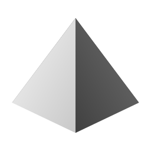

<p align="center">
  
</p>

<h3 align="center">
Scaling agents for everyone
</h3>

<p align="center">
| <a href="https://tetral.ai"><b>Website</b></a> | <a href="https://github.com/tetral-ai/tetral-sdk-typescript"><b>TypeScript SDK</b></a> | <a href="#getting-started"><b>Getting Started</b></a> | <a href="AGENTS.md"><b>Contributing</b></a> | <a href="LICENSE"><b>License</b></a> |
</p>

---

## About

Tetral is an open-source platform for scaling AI agents. The agent loop runs
as a first-class cloud runtime on your own Kubernetes — sessions are durable
resources that sleep when idle, wake on input, and keep going through sandbox
and pod restarts — behind an Anthropic-compatible API. Cost follows active
compute.

Tetral scales agents with:

- **A cloud-native runtime**: the agent loop is scheduled by Kubernetes;
  sessions sleep and wake; settlement is durable and replay-safe; sandbox
  loss and runtime-pod loss are recovered conditions, handled by design.
- **Disposable sandboxes**: every session gets its own sandbox as an
  execution surface — created on demand, stopped when idle, archived and
  cleaned up on schedule.
- **One database**: sessions, full event history, queues, memory,
  credentials — everything durable lives in PostgreSQL. One system to
  operate and back up, and the complete audit trail is a SQL query.
- **Single-version releases**: one git tag, four images, and one Helm chart
  carry the same platform version.

Tetral is compatible and complete:

- **Anthropic-compatible API**: sessions, files, skills, memory stores, and
  models served under `/v1` in the upstream shape; the
  [TypeScript SDK](https://github.com/tetral-ai/tetral-sdk-typescript) is a
  maintained fork of the official Anthropic SDK, and every deviation is a
  registered compatibility case with a test.
- **Bring your own model**: request lowering, stream raising, and the model
  catalog live in one gateway package — adding a model or provider is a
  catalog-and-lowering change.
- **A full agent toolbelt**: per-session sandboxes, file resources, skills,
  memory, MCP connectors, web search and fetch, and credential-injecting
  Git — sandboxes never hold repository credentials.
- **Storage you choose**: one S3-compatible configuration surface across
  Cloudflare R2, AWS S3, MinIO, and B2.
- **Sandboxes you choose**: sandbox providers sit behind a narrow driver
  seam (Daytona today).

## Getting Started

Tetral is self-hosted infrastructure for teams that operate their own
Kubernetes. It deploys on any conformant cluster — from a single-node K3s
machine to a full multi-node cluster, the same manifests and the same
version. Prerequisites:

- Kubernetes 1.33–1.36.
- A separately installed [Istiod](deploy/istio/README.md); internal routing
  requires it in every profile, even with one replica.
- [Envoy Gateway and the Gateway API CRDs](deploy/envoy-gateway/README.md) for
  the public edge.
- A [Core NATS broker](deploy/nats/README.md) while public previews are
  enabled, which is the default.
- PostgreSQL 18 reachable over verified TLS (CA and server name), plus a
  separate administrative connection used only by the one-shot database
  preparation and Auth policy import commands.
- An S3-compatible bucket reached over verified HTTPS.
- A credential for a Daytona Tier 3 or higher account for the current Sandbox
  provider implementation.
- [cert-manager](deploy/cert-manager/README.md) only for the hardened
  profile's native-certificate automation.

The [managed installation contract](deploy/managed/README.md) gives the ordered
preparation, installation and admission sequence.

Two install paths, one platform version:

- **Helm** — reproducible, versioned installs: chart values, operator-created
  Secrets and the separately installed prerequisites above make up the
  configuration. The first installation of this architecture uses a dedicated
  empty database; there is no in-place database upgrade from earlier releases.
  The [service-stack upgrade guide](docs/upgrade-service-stack.md) lists what an
  existing installation changes and what cannot be carried over. Later
  compatible revisions follow the chart's
  [database preparation and compatible rollout](deploy/helm/tetral/README.md#database-preparation-and-compatible-rollout)
  procedure; `helm rollback` changes workloads, not database state.
- **Source examples** — the raw manifests in
  [`deploy/kubernetes/`](deploy/kubernetes/) use an explicit development
  image identity. They are auditable deployment examples, not a versioned
  release channel.

Numbered Alpha releases use `v0.1.0-alpha.N`. GitHub Releases is the sole
availability lookup: if no numbered Alpha appears there, no public Alpha is
available yet. A release page records the exact source, four image digests,
and Helm artifact to install. Until then, build from source:

```bash
make build && make test          # build plus fast no-infrastructure evidence
bun install && bun run build     # services/agent-runtime, services/gateway
```

Before the first install, follow the
[from-zero bootstrap sequence](docs/bootstrap.md) to generate the required
Secrets, install the database roles/schema contract, and seed the initial
workspace.

Configure client API keys or explicit OIDC federation with the
[authentication guide](docs/authentication.md); Auth's operator contract covers
registered issuers, Engine workspace grants and administrative provisioning.

Each service's contract — responsibilities, lifecycle, seams, testing —
lives in `services/<name>/README.md`.

Bridge handles Runtime RPCs and durable settlement; Job Runner consumes Queue
work and owns Runtime placement, delivery and recovery. They run in separate
workloads with separate database pools and process resources. Provider Gateway,
MCP Connector and Web Connector also deploy independently. See the
[service map](AGENTS.md#service-map) for their owning packages and contracts.

Repository test profiles, CI ownership, and evidence artifacts are documented
in [docs/testing.md](docs/testing.md).

## Contributing

Contributions are welcome from any authorship — human, AI, or both — as
long as you can explain them. Start with [AGENTS.md](AGENTS.md) for the
repository map and build commands, then [CONTRIBUTING.md](CONTRIBUTING.md)
for the pre-PR self-check every contribution runs.

## Contact

Questions, bug reports, and proposals go to
[GitHub Issues](https://github.com/tetral-ai/tetral/issues). If you are
building on Tetral or want to collaborate more deeply, we would like to
hear from you.

## Acknowledgment

Tetral learned from and builds with:
[OpenCode](https://github.com/sst/opencode),
[Codex](https://github.com/openai/codex),
[Effect](https://effect.website),
[Daytona](https://www.daytona.io),
[Cloudflare](https://www.cloudflare.com), and
[Anthropic](https://www.anthropic.com).

## License

[MIT](LICENSE). Commercial use is welcome; if Tetral or its design shows up
in your work, a credit is appreciated.
