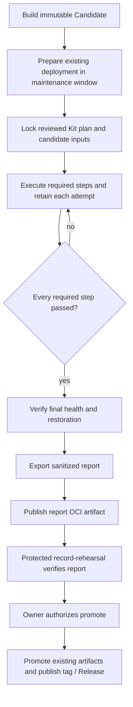

# Rehearsal evidence and release

Release accepts a verified step-level report from the operator-owned rehearsal
kit. A manually entered `pass`, case count, or digest of an unspecified local
directory is no longer sufficient for new recording or promotion.



The kit owns the evolving case catalog, actual execution, recovery checks and
private evidence. The Engine release contract owns the report format, Candidate
binding and publication gate. Preparing or upgrading a deployment remains a
separate operational action; recording a report does not install services, run
database preparation, or clean a workspace. Promotion reuses the accepted
Candidate artifacts; it does not rebuild them or automatically deploy them.

## Report contract

`tetral.rehearsal-report/v1` embeds a `tetral.rehearsal-plan/v1` plan containing:

- Safe round and step IDs, with each step mapped to a parent case ID.
- Version, Engine source commit and Candidate OCI manifest digest.
- Kit commit, SDK revision and SDK package-content manifest digest.
- Digests of the operator's actual values and rendered manifests.

The plan digest is SHA-256 of compact UTF-8 JSON with recursively sorted object
keys, preserved array order and no trailing newline. All exported identifiers
are bounded ASCII strings. The report contains each completed attempt's step
ID, sequential attempt number, verdict, timestamps and evidence digests, plus
the final health/restoration observation. It has no arbitrary notes, paths,
credentials or raw diagnostic fields. Unknown fields are rejected before
report packaging and recording.

Only a later complete attempt for the **same step** can supersede its earlier
result. A PASS for another step of the same parent case cannot hide a failure.
Every required step's latest attempt must pass. Missing steps, incomplete
attempts, invalid numbering, missing evidence digests and failed recovery reject
acceptance. The final check must pass after all attempts. Timestamps record
execution order; reports have no fixed expiration period.

Engine derives case count, result, timestamps, plan and evidence digests from
the report. Case count counts distinct parent IDs, not steps or Sessions. Actual
operator values/render digests are not forced to equal the Candidate's default
Chart render; those are different inputs.

## Protected handoff

After reviewing the Kit's exported `report.json`, an authorized operator with
registry credentials can publish its sanitized contents from this repository:

```sh
./scripts/release-oci-record.sh publish rehearsal-report report.json \
  ghcr.io/tetral-ai/tetral-release-metadata:report-<unique-round-id>
```

The command validates and canonicalizes the report, prints its **OCI manifest
digest**, and refuses replacing an existing reference with different bytes.
This digest differs from a hash of the input JSON file. No local path enters
the published report.

Dispatch the `Release` workflow on main with:

- `mode=record-rehearsal`;
- the Candidate's `version`, `source_commit` and `candidate_digest`;
- `report_digest` from the publication command.

The protected job fetches the Candidate and report from the fixed metadata
repository by digest, verifies their identity and reconciles every planned
step, then publishes immutable Rehearsal Evidence. That evidence embeds the
report and its artifact digest. After owner review, dispatch `mode=promote`
with the same Candidate identity and the recorded `evidence_digest`. The
existing protected authorization and artifact/tag/Release checks still apply.

## What acceptance proves

The release validator independently checks the supplied report's integrity,
Candidate identity, planned-step completeness and timing. It does not download
the private Kit catalog or raw SQL/Loki/provider evidence, re-run experiments,
or independently prove the operator chose sufficient cases. The reviewed Kit
and protected operator remain responsible for catalog completeness, actual
deployment/SDK identity checks, evidence custody, and truthful observations.
A digest identifies bytes; it is not proof that an experiment occurred.

The Kit must reject missing or changed evidence before export. Its current
report digests bind captured per-attempt ledgers; independently written SQL,
Loki and provider files remain under the private evidence index. The report
must not claim those files were imported when they were not. Missing live case
owners must remain explicit unsupported obligations, preventing acceptance.

## Verification

`internal/release/testdata/kit-report-v1.json` is generated by the real Python
Kit runner and ledger writer against synthetic commands. The Go test runs it
through the actual Release CLI's OCI packaging, layout readback, recording and
promotion validation. It also rejects a failed sibling step and evidence without
an embedded report. These tests verify the protocol handoff; they are not a live
deployment rehearsal.
